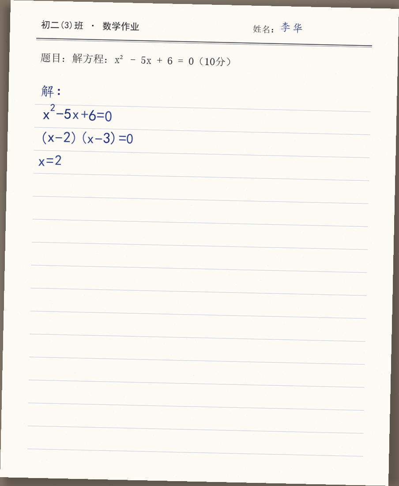
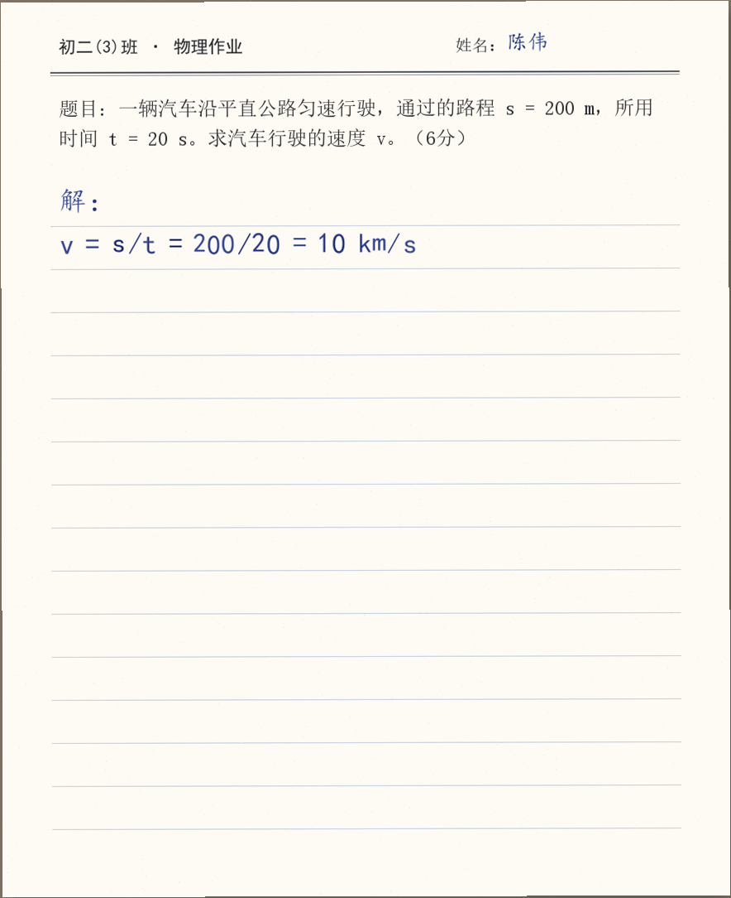

# 批改样例与数据分析样本

> 本文对应命题交付要求"批改样例展示：输入作业图片 → 输出批改结果 + 评语 + 薄弱点分析"。第一部分逐份解读 `samples/` 下三份样例（数学 / 物理 / 英语，每份均配可上传复现的输入图片），并补充两份新增作答（SUB010 / SUB011）的教学意义；第二部分为模拟班级学情样本，第三部分说明数据口径。字段与规则遵循详细设计方案 §6、§9、§14。
>
> **模拟数据声明**：全文所有学生姓名、作答内容与作业图片均为模拟数据，不含任何真实学生信息。输入图片为程序合成的仿手写作业照片——由 `demo/tools/gen_sample_images.py` 以手写风格字体逐字符渲染并叠加拍照效果生成，共 11 张（SUB001–SUB011），与 `demo/data/submissions.json` 的 11 份内置作答一一对应。

---

## 一、批改样例解读

三份样例分别取自 Demo 内置数据集的 SUB002（数学·李华）、SUB005（物理·陈伟）、SUB008（英语·吴敏），覆盖三个学科、绿 / 黄两档分流与"抽查确认 / 一键确认 / 人工微调"三种教师处理方式（红色转人工档由同数据集的 SUB003 / SUB009 两份字迹模糊作答承担，见本节末尾），完整演示系统的五个核心卖点：**部分正确给过程分、步骤级证据链、错因归因、红黄绿分流、教师可控**。统一采用"输入作业图片 → 手写识别（OCR 转写）→ AI 过程级批改（逐步给分 + evidence 证据引用）→ 置信度分流 → 教师审核 → 薄弱点分析"结构，字段与设计方案 §9.5、§14.3、§15.1 一致；所有分数、置信度与分流结果与 Demo 实际批改输出（默认离线规则引擎，确定性可复现）逐位一致。

| 样例 | 输入图片 | 对应作答 | AI 判分 | 置信度 | 分流 | 教师动作 |
| ---- | -------- | -------- | ------- | ------ | ---- | -------- |
| 一（数学） | `SUB002.png` | SUB002 李华 · Q001 | 6/10 | 78.1 | 黄 | 一键确认 6 分 |
| 二（物理） | `SUB005.png` | SUB005 陈伟 · Q002 | 5/6 | 92.5 | 绿 | 抽查确认 5 分 |
| 三（英语） | `SUB008.png` | SUB008 吴敏 · Q003 | 10/15 | 76.0 | 黄 | 微调为 11 分 |

### 样例一：数学·因式分解解一元二次方程（黄色·教师一键确认）



> 输入图片为程序合成的仿手写作业照片（无真实学生信息）。在 Demo「① 拍照提交」中上传该图，系统经感知哈希匹配（配多模态密钥后为真实识别）完成转写并自动批改，可离线复现本样例全流程。

**输入。** 题目为"解方程：x² - 5x + 6 = 0"（满分 10 分）。OCR 转写学生三行作答（卷面清晰度 88）：`x²-5x+6=0 → (x-2)(x-3)=0 → x=2`。

**AI 如何逐步批改（含证据链）。** 系统按 Rubric 把题目拆为"选择解法 → 因式分解 → 求出两根 → 结论表达"四步逐项给分，**每一步都带 `evidence` 字段，引用学生作答原文片段作为判断依据**：

```json
"step_analysis": [
  {"step": "选择合适解法", "is_correct": true,  "score": 2, "max_score": 2, "evidence": "(x-2)(x-3)=0"},
  {"step": "因式分解正确", "is_correct": true,  "score": 3, "max_score": 3, "evidence": "(x-2)(x-3)=0"},
  {"step": "求出两个根",   "is_correct": false, "score": 1, "max_score": 3, "error_tag": "步骤缺失",
   "reason": "只求出 x=2，漏掉由 (x-3)=0 得到的 x=3", "evidence": "x=2"},
  {"step": "结论表达完整", "is_correct": false, "score": 0, "max_score": 2, "error_tag": "表达不完整",
   "reason": "结论只写一个根，未完整给出两个解", "evidence": "x=2"}
]
```

**证据链如何支撑判定。** "求出两个根"一步判为 `步骤缺失` 时，`evidence` 引用的是卷面原文 `x=2`——判定"漏根"的依据不是模型的笼统印象，而是可回溯的原文片段：卷面上确实只写了这一个根。教师审核时点开该步即可对照原文核实，学生申诉也有据可查；若某步字迹无法辨认，配套的 `legible` 字段会置为 false、系统如实标注"字迹难辨"并压低置信度转人工，而不是猜测作答内容。这就是"步骤级证据链批改"相对黑盒打分的差异。

**为何给过程分。** 解法选择（2 分）与因式分解（3 分）全对照给；漏根一步并非全无价值——x=2 本身是正确根之一，按部分分比例保留 1 分；结论不完整 0 分。总分 **6/10**，而不是"答案不全判 0 分"。这正是"识别部分正确的解题过程并给予过程分"的直接体现。

**为何落入黄色。** 按 §9.7 加权公式（百分制）：`88×0.25 + 70×0.25 + 85×0.20 + 68×0.20 + 80×0.10 = 78.1`——最终答案与标准答案匹配度偏低（70）、两次批改一致性一般（68），落在 `60 ≤ c < 85` 区间判为 `yellow`：AI 给出建议分，交教师一键确认或微调。

**教师如何处理 / 学生看到什么。** 教师动作为 `confirmed`（一键确认），终分维持 6 分。学生看到的评语（Demo 规则引擎按"先肯定 → 指关键问题 → 给建议"模板确定性生成，同错因不同学生措辞不同）：

> 这次作答中选择合适解法、因式分解正确完成得不错，看得出你思考得很认真。本次主要问题出在「求出两个根」，属于步骤缺失。把每一步推理都写在卷面上，检查时逐步核对是否有遗漏。写完后对照题目所求检查一遍，别漏写任何一问的答案。

### 样例二：物理·速度与单位换算（绿色·抽查确认）



> 输入图片为程序合成的仿手写作业照片（无真实学生信息），在 Demo「① 拍照提交」中上传该图即可复现本样例全流程。

**输入。** 题目为匀速直线运动求速度：s=200 m、t=20 s（满分 6 分）。OCR 转写学生一行作答（清晰度 94）：`v = s/t = 200/20 = 10 km/s`。

**AI 如何逐步批改（含证据链）。** 公式（2/2）、代入（2/2）、计算（1/1）全对照给，唯一失分在单位步：

```json
{"step": "单位正确", "is_correct": false, "score": 0, "max_score": 1,
 "error_tag": "单位错误",
 "reason": "结果单位应为 m/s，学生写成 km/s，属单位表达错误",
 "evidence": "10 km/s"}
```

**证据链如何支撑判定。** 单位错误的 `evidence` 精确到卷面片段 `10 km/s`——不是"单位有问题"的泛泛提示，而是把误写的那个单位原文摘出来放在判定旁边，教师一眼即可核实。总分 **5/6**，错因标签唯一且精确：`单位错误`（而非笼统的"计算错误"），补救方向随之明确：不必重学速度公式，只需补单位规范。

**为何是绿色，以及"绿 ≠ 全对"。** `94×0.25 + 90×0.25 + 100×0.20 + 90×0.20 + 85×0.10 = 92.5 ≥ 85`，按 §9.7 判为 `green`，AI 自动通过。注意分流反映的是 **AI 置信度**而非学生对错——本例 AI 以高置信度定位了单位错误并直接完成批改，教师只需抽查，这正是绿色档"省教师时间"的方式。

**教师如何处理。** 教师抽查后 `confirmed`，终分 5 分，并补一句数量级自检建议：10 km/s 已超过第一宇宙速度（7.9 km/s），汽车不可能达到——学生若养成"结果合理性自检"的习惯，这类失误可当场发现。学生看到的评语：

> 你在写出正确公式、正确代入数值、计算结果正确方面是正确的，说明基本思路没有问题。本次主要问题出在「单位正确」，属于单位错误。代入数值前先统一单位，最终结果记得写对单位。

### 样例三：英语·短文写作 My Weekend（黄色·教师微调）


> 输入图片为程序合成的仿手写作业照片（无真实学生信息），在 Demo「① 拍照提交」中上传该图即可复现本样例全流程。

**输入。** 题目要求以 "My Weekend" 为题写不少于 60 词短文，Rubric 按 **内容 / 语法时态 / 词汇拼写 / 句式连贯** 四维度给分（4/4/3/4，共 15 分）。OCR 转写（清晰度 85）：

```
Last weekend I have a good time. On Saturday I go to the park with my family.
We play games and eat lunch there. On Sunday I stay at home and watch TV.
It is a happy weekend for me.
```

**AI 如何逐步批改（含证据链）。** 内容切题、要点完整，给满分 4/4（**先肯定内容完整性**）；语法时态 1/4——判定依据不是抽象的"时态不对"，而是 `evidence` 直接引用原文：

```json
{"step": "语法与时态正确", "is_correct": false, "score": 1, "max_score": 4,
 "error_tag": "概念理解错误",
 "reason": "全文应用一般过去时，多处动词误用现在时：have/go/play/eat/stay/watch/is",
 "evidence": "On Saturday I go to the park with my family. We play games and eat lunch there."}
```

词汇拼写 3/3（本篇拼写无误）；句式连贯 2/4（句式单一、缺衔接词，`evidence` 引用末两句为证）。总分 **10/15**。

**错因标签映射。** 英语作文错因映射到设计方案 §6.11 的统一错因枚举：系统性时态误用属语法概念未掌握 → `概念理解错误`；句式单一、缺少衔接 → `表达不完整`。两个标签均可沿证据链回溯到具体原文句子。

**为何落入黄色。** 主观书面表达的答案匹配度低（68）、两次批改一致性一般（66），加权 `85×0.25 + 68×0.25 + 85×0.20 + 66×0.20 + 76×0.10 ≈ 76.0`，落在 `60 ≤ c < 85` 判为 `yellow`：AI 判分仅作建议，教师确认后才生效。

**教师如何处理（可控性）。** 教师动作为 `modified`：认可内容与时态两步的判定，但认为短文按时间顺序展开、达意清楚，将"句式结构与连贯"由 2 分微调为 3 分，总分由 AI 建议的 10 **微调为 11/15**，并改写评语。这演示了教师对分数与评语的完全可控。学生最终看到的评语：

> 内容要点齐全、拼写也不错，值得肯定。最需要突破的是时态：写上周末的事要通篇用一般过去时（have→had、go→went、play→played）。再学着用 First / Then / After that 把句子串起来，短文会更连贯。

**红色档在哪里演示。** 三份精选样例落在绿 / 黄两档；红色"AI 不判分、整题转人工"由内置数据集中两份低清晰度作答承担：SUB003（王芳·数学，清晰度 55，置信度 54.0，末步 `legible=false`）与 SUB009（郑浩·英语，清晰度 58，置信度 51.6）。在 Demo 中上传 `SUB003.png` / `SUB009.png`，即可看到红色分流下"字迹难辨步骤如实标注、不猜测、交教师人工"的行为。

### 新增作答的教学意义：SUB010 / SUB011 与张明的跨学科画像

内置数据集已从 9 份扩充为 **11 份作答**（SUB001–SUB011，均配同名合成图片）。新增的两份都是模拟学生"张明"的作答，补齐了两类此前未覆盖的典型形态：

**SUB010（张明·物理，AI 判 5/6，黄色，错因：`答案正确但过程不规范`）。** 卷面只写 `v = 200/20 = 10 m/s`——答案完全正确，但跳过了公式原式 `v=s/t`。只看结果的批改会给满分，问题被永久掩盖；过程级批改在"写出正确公式"一步按部分分给 1/2，该步 `evidence` 为**空字符串**（学生未写出对应内容，系统如实置空、绝不臆造补全），错因命中十类枚举中最易被忽视的 `答案正确但过程不规范`。置信度 79.9 落黄档，"过程分该不该扣"交教师确认——这正是过程分与错因标签相对"只判对错"的增量价值：**它让"对了但不规范"从满分卷里显形**。

**SUB011（张明·英语，AI 判 14/15，绿色，错因：`符号书写错误`）。** 绿区高分作答：内容、时态、连贯全对，仅 `intresting` 一处拼写错（应为 interesting），`evidence` 精确到这个单词，置信度 90.8 自动通过。它演示了"绿 ≠ 不批"：高分作答同样逐步出证据，个别拼写错被精确定位并计入画像，而不是被 14/15 的总分淹没。

**跨学科画像。** 张明由此拥有三份跨学科作答：数学 SUB001（10/10，绿）、物理 SUB010（5/6，黄）、英语 SUB011（14/15，绿）。单科单次看他几乎无懈可击；跨学科聚合后画像浮现一条一致线索——**知识掌握扎实，仅有的失分全部来自规范性细节**（物理不写公式原式、英语拼写笔误）。学情页据此给出的建议不再是笼统的"多做题"，而是"过程书写规范 + 拼写自查"的习惯矫正。这是单科、单次批改都给不出的画像结论，也是三份作答同入一库的意义。

三份精选样例（绿 / 黄）加上红档的 SUB003 / SUB009，恰好演示了系统在"高置信自动通过、中置信教师确认、低置信转人工"三档下的差异化行为；SUB010 / SUB011 再补上"答案对但过程不规范"与"绿区高分带小错"两类形态，并与 SUB001 一起构成跨学科画像数据。从判分、证据、归因到评语、审核、画像，闭环完整。

---

## 二、模拟班级学情分析样本

> **以下为模拟数据，用于演示系统的分析口径与报告形态，非真实采集数据。**

**设定。** 初二（3）班共 45 人，物理《欧姆定律与电路》作业 8 题（第 1–4 题基础、第 5–6 题中档、第 7–8 题综合）。共产生 45 人 × 8 题 = **360 题次** 的批改记录，全部数据由三份样例同款的批改结果聚合而来。

### 表 1　逐题正确率与主要错因

| 题号 | 难度 | 主要知识点 | 正确人数 | 正确率 | 答错人数 | 主要错因 | 次要错因 |
| ---- | ---- | ---------- | -------- | ------ | -------- | -------- | -------- |
| 1 | 基础 | 欧姆定律应用 | 42 | 93.3% | 3 | 计算错误 | 单位错误 |
| 2 | 基础 | 单位换算 | 38 | 84.4% | 7 | 单位错误 | 计算错误 |
| 3 | 基础 | 串并联识别·电路等效 | 39 | 86.7% | 6 | 计算错误 | 概念理解错误 |
| 4 | 基础 | 串并联电路识别（并联） | 35 | 77.8% | 10 | 图形理解错误 | 概念理解错误 |
| 5 | 中档 | 欧姆定律·电压电流分配 | 30 | 66.7% | 15 | 公式选择错误 | 计算错误 |
| 6 | 中档 | 串并联识别·电压电流分配 | 24 | 53.3% | 21 | 图形理解错误 | 公式选择错误 |
| 7 | 综合 | 混联电路·电路等效 | 18 | 40.0% | 27 | 图形理解错误 | 单位错误 |
| 8 | 综合 | 电功率计算·欧姆定律 | 15 | 33.3% | 30 | 概念理解错误 | 图形理解错误 |
| **合计 / 平均** | — | — | **241** | **66.9%** | **119** | — | — |

正确人数合计 241 + 答错人数合计 119 = 360 题次，与"45 × 8"一致；随难度上升正确率单调下降，符合基础 / 中档 / 综合的梯度。

### 表 2　知识点错误率排行

| 排名 | 知识点 | 相关题 | 错误人次 | 答题人次 | 错误率 |
| ---- | ------ | ------ | -------- | -------- | ------ |
| 1 | 电功率计算 | 8 | 30 | 45 | 66.7% |
| 2 | 串并联电路识别 | 4,6,7 | 58 | 135 | 43.0% |
| 3 | 电压 / 电流分配规律 | 5,6 | 36 | 90 | 40.0% |
| 4 | 电路等效与化简 | 3,7 | 33 | 90 | 36.7% |
| 5 | 欧姆定律应用 | 1,5,8 | 48 | 135 | 35.6% |
| 6 | 单位换算 | 2 | 7 | 45 | 15.6% |

> 口径：错误率 = 考查该知识点的题目上的"答错人次" ÷ 该组题目"总答题人次"（45 × 题数）；一题可归入多个知识点，各行分母存在重叠，本表用于知识点**难度排序**，不做纵向加总。电功率计算虽单题错误率最高（仅 Q8 一题），但"串并联电路识别"横跨三题、影响面最广，且是 Q5–Q8 公式选择错误的上游根因，因此被系统判定为**班级头号薄弱点**。

### 表 3　错因分布统计

| 排名 | 错因标签 | 出现次数 | 占比 |
| ---- | -------- | -------- | ---- |
| 1 | 图形理解错误 | 38 | 25.5% |
| 2 | 单位错误 | 30 | 20.1% |
| 3 | 公式选择错误 | 24 | 16.1% |
| 4 | 计算错误 | 22 | 14.8% |
| 5 | 概念理解错误 | 16 | 10.7% |
| 6 | 步骤缺失 | 8 | 5.4% |
| 7 | 表达不完整 | 6 | 4.0% |
| 8 | 答案正确但过程不规范 | 5 | 3.4% |
| 9 | 审题错误 | 0 | 0.0% |
| 10 | 符号书写错误 | 0 | 0.0% |
| **合计** | — | **149** | **100.0%** |

> 错因标签体系共 10 类（设计方案 §6.11 第二层），本次作业实际触发 8 类。错因总次数 149 与答错题次 119 的关系：**每道错题标注 1~2 个错因**（1 个主错因，若存在明显连带的第二成因再加 1 个次错因），本次 119 道错题中 89 题标 1 个、30 题标 2 个，即 89 × 1 + 30 × 2 = 149，故"错因次数 ≥ 错题次数"符合口径。占比按 149 为分母计算，四舍五入后合计为 100.0%。"图形理解错误"（串并联结构识别）占比居首，与表 2 的头号薄弱点相互印证。

### 表 4　红黄绿分流统计

| 分流 | 含义与处理方式 | 题次 | 占比 | 教师单题耗时 | 该类合计耗时 |
| ---- | -------------- | ---- | ---- | ------------ | ------------ |
| 绿色 | 高置信度，自动通过 + 抽查 | 263 | 73.1% | 10 s | 2630 s（43.8 min） |
| 黄色 | 中置信度，一键确认 / 微调 | 71 | 19.7% | 20 s | 1420 s（23.7 min） |
| 红色 | 低置信度，教师人工批改 | 26 | 7.2% | 45 s | 1170 s（19.5 min） |
| **合计** | — | **360** | **100.0%** | — | **5220 s（87 min）** |

- **AI 自动通过率** = 绿色 263 ÷ 360 = **73.1%**；**需教师处理量** = 黄 71 + 红 26 = **97 题次（26.9%）**。
- **耗时对比**（假设纯人工批改每题均耗时 45 s）：纯人工 360 × 45 s = 16200 s = **270 min**；系统辅助后教师实际耗时 = 绿 263×10 + 黄 71×20 + 红 26×45 = 5220 s = **87 min**。
- **节省** 10980 s = **183 min**，节省比例 **67.8%**，显著优于设计方案 §18.1"减少 30% 以上"的目标（估算基于上述单价假设，实际以现场计时为准）。

分流逐题构成（每题绿 + 黄 + 红 = 45，验证 360 的分解）：

| 题号 | 1 | 2 | 3 | 4 | 5 | 6 | 7 | 8 | 合计 |
| ---- | -- | -- | -- | -- | -- | -- | -- | -- | ---- |
| 绿 | 43 | 40 | 41 | 37 | 32 | 28 | 22 | 20 | 263 |
| 黄 | 2 | 4 | 3 | 6 | 10 | 13 | 16 | 17 | 71 |
| 红 | 0 | 1 | 1 | 2 | 3 | 4 | 7 | 8 | 26 |

> 注：分流反映的是 **AI 置信度**而非对错——绿色题中也包含被 AI 高置信度判为"错"的题（如样例一那样能精确定位错误的题）。综合题（Q7、Q8）因结构复杂、手写不确定，红黄比例明显升高。

### 三名典型学生画像片段

**① 进步型——王雨（化名）。** 本次 8 题对 7，唯一错题在 Q7（混联识别，图形理解错误）。系统调取其历史画像：近三次作业"计算错误"占比 40% → 22% → 9% **连续下降**，说明计算已趋于稳定，当前薄弱迁移到"混联电路识别"。系统判定为"从不会到掌握、计算转稳"的进步型，补救指向直接进阶综合题。

**② 粗心型——陈浩（化名）。** 本次 8 题对 6，两道错题（Q2、Q5）**均含单位错误**；而串并联识别类题（Q4、Q6）全部做对，说明概念清楚。历史画像显示单位错误近三次每次≥2 处、反复出现。系统判定为"会做但粗心、单位失分型"，补救指向单位换算与解题规范的限时专项、强制"回看单位"。

**③ 概念缺失型——刘洋（化名）。** 本次 8 题仅对 3，5 道错题集中在 Q4、Q6、Q7、Q8 与 Q5，错因为图形理解错误（Q4/Q6/Q7）叠加概念理解错误（Q8）；串并联相关题正确率不足 30%。因"串并联识别"这一知识点连续三次作业出错，触发设计方案 §6.16 的**学习风险预警**。补救需从串并联识别的基础概念补起，先只判结构、不计算，过关后再进入计算。

三名学生的错因分布与全班一致（图形理解错误为首、单位错误其次），且个体数字均落在对应题目的答错人数之内，与表 1–表 4 不矛盾。

### 基于数据自动生成的下节课讲评建议

依据上述聚合结果，系统按设计方案 §15.3 的格式生成讲评方案：

1. **班级主要问题。** 头号薄弱是"串并联电路识别"——错因分布中"图形理解错误"以 38 次（25.5%）居首，且是 Q4、Q6、Q7 的主要错因，更是 Q5–Q8 公式选择错误（24 次）的上游根因；其次是电功率综合应用（Q8 正确率仅 33.3%）与单位规范性（单位错误 30 次）。
2. **下节课讲评顺序**（按知识依赖，先根因后综合）：① 串并联识别（用实物 / 动画对比串、并联结构，训练"先辨结构再动笔"）→ ② 串并联中的电压 / 电流分配规律（衔接 Q5、Q6）→ ③ 欧姆定律在混联电路中的应用（Q7）→ ④ 电功率综合（Q8，辨析 P=UI / P=I²R / P=U²R 的选用）。
3. **分层辅导。** 进步型（如王雨）跳过基础、直接做混联 + 电功率拔高题；粗心型（如陈浩）做单位换算与规范书写限时训练；概念缺失型（如刘洋）从串并联识别基础概念补起。
4. **复测题。** 布置 5 题——2 题串并联识别（纯判别）、1 题串 / 并联对照计算、1 题混联、1 题电功率综合，下次作业作为复测，重点跟踪"图形理解错误"占比是否下降。

---

## 三、数据口径与字段说明

各表均由批改结果表 `question_results`（每份提交每题一条记录，字段见设计方案 §10.1、§14.3：`final_score`、`max_score`、`confidence`、`triage_status`（Demo 原型 API 返回中简写为 status）、`error_tags`、`knowledge_points`）聚合而来，聚合口径如下。

- **题次基数。** 45 人 × 8 题 = 360 条记录 = 360 题次；表 1 正确 + 答错、表 4 绿 + 黄 + 红均以 360 为总量闭合。
- **表 1（逐题）。** 正确人数 = 该题 `final_score == max_score`（得满分）的人数；答错人数 = 45 − 正确人数（含部分正确者）；正确率 = 正确人数 ÷ 45；主要 / 次要错因 = 该题所有记录的 `error_tags` 按出现频次排序取前两位。
- **表 2（知识点错误率）。** 先建立"题目 → 知识点"映射（一题可映射多个知识点）；某知识点错误率 = 映射到它的题目集合上的答错人次 ÷ 该集合总答题人次。分母因多重映射而重叠，故本表只用于排序、不加总。
- **表 3（错因分布）。** 对全部 360 条记录的 `error_tags` 逐一计数；标注口径为每道错题 1~2 个错因（主错因必有，次错因视连带成因而定），故总次数（149）≥ 答错题次（119）；占比 = 各标签次数 ÷ 149。
- **表 4（红黄绿分流）。** 按每条记录的 `triage_status` 统计；分流阈值取自 §9.7（百分制，与 Demo 批改输出同口径）：`confidence ≥ 85` 绿、`60 ≤ confidence < 85` 黄、`confidence < 60` 红。AI 自动通过率 = 绿 ÷ 360；需教师处理量 = 黄 + 红；耗时估算 = 各类题次 × 假设单题耗时（纯人工基准 45 s，绿色抽查 10 s、黄色一键确认 20 s、红色人工批改 45 s）。此处的分流反映 AI 置信度而非答案对错。
- **学生画像。** 高频错因、薄弱知识点、进步趋势、学习风险由该生历史 `error_tags` 与得分序列按设计方案 §6.15–§6.16 聚合；"同一知识点连续三次出错"即触发学习风险预警。

以上口径保证四张表、学生画像与批改样例之间数字一致：样例中出现的"步骤缺失""表达不完整""单位错误""概念理解错误""答案正确但过程不规范"等标签，正是班级错因分布表（表 3 十类枚举）中的统计对象；样例二与 SUB010 暴露的"单位错误""答案正确但过程不规范"，分别对应表 3 中 30 次（20.1%）与 5 次（3.4%）的班级统计项——个案与聚合口径同源，微观证据链可直接向上汇成宏观学情。
