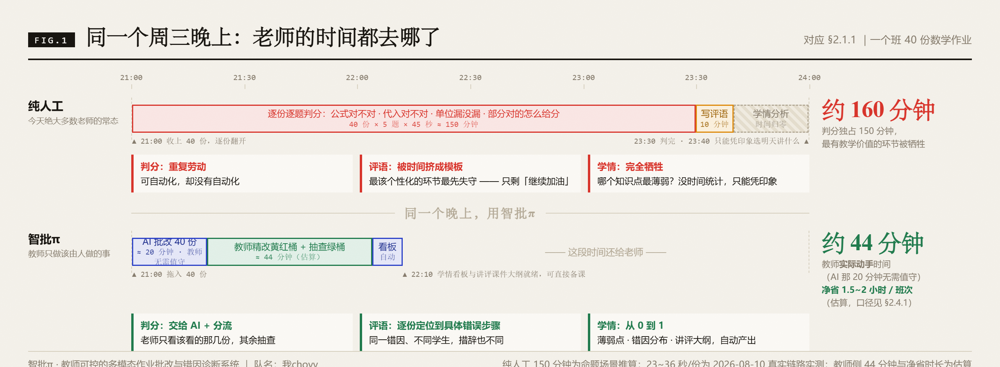
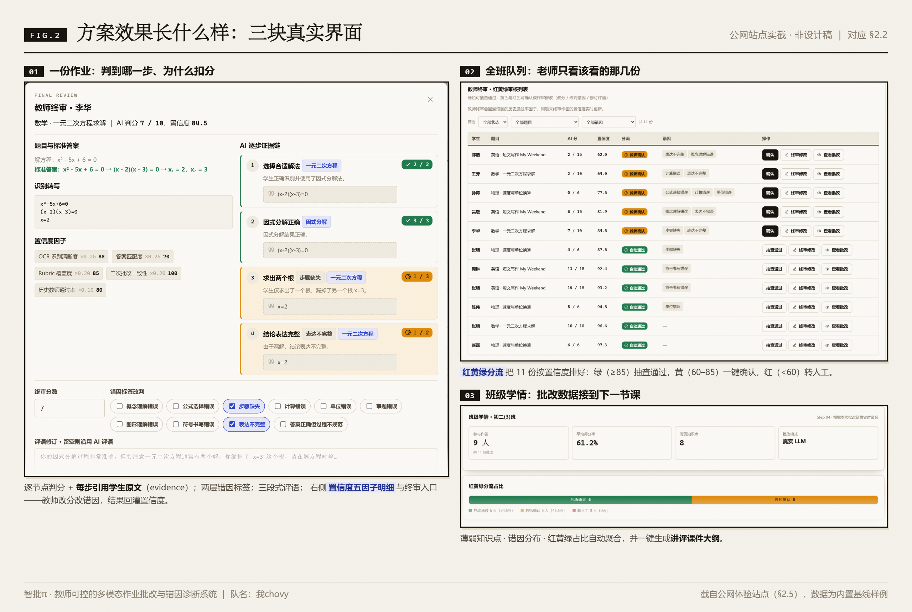
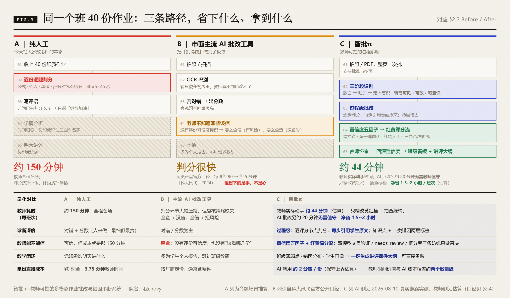
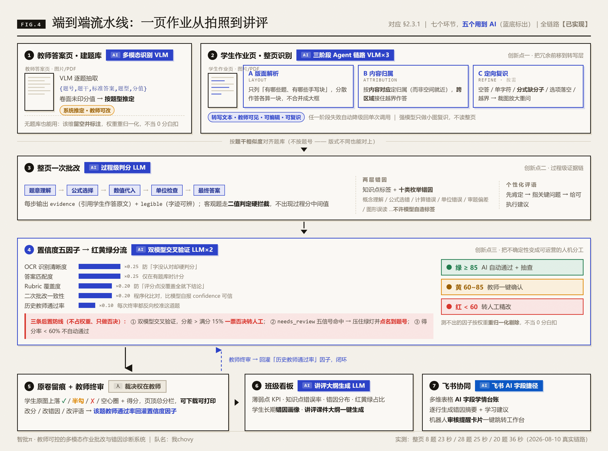
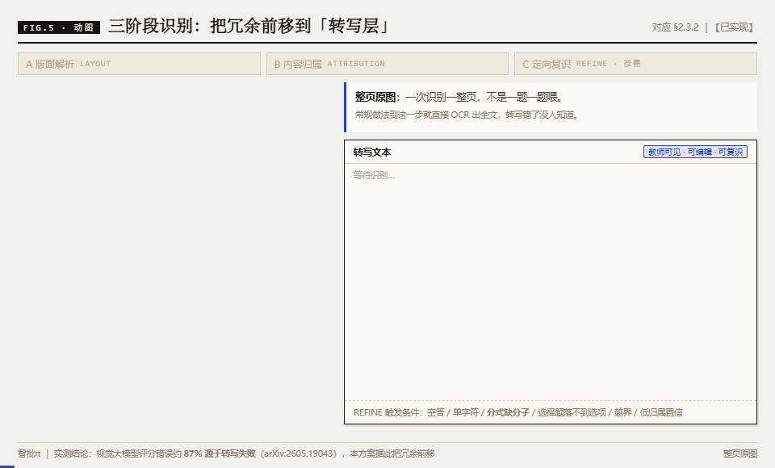
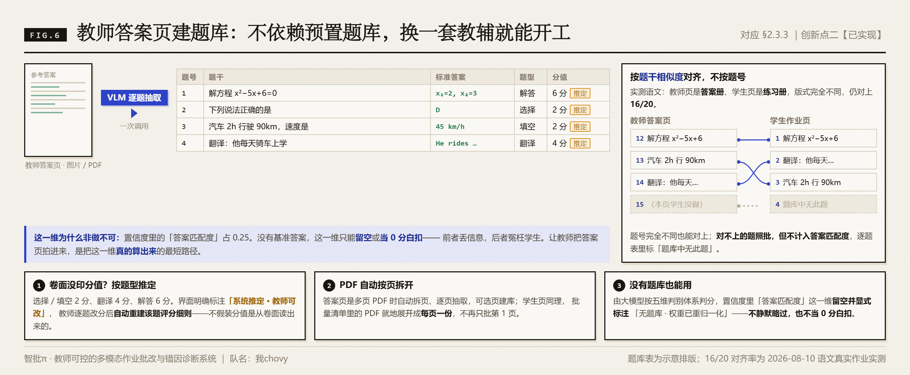
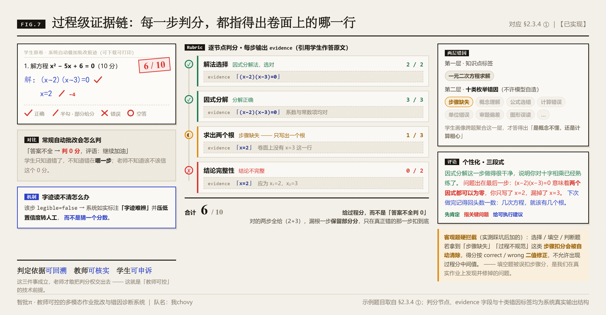
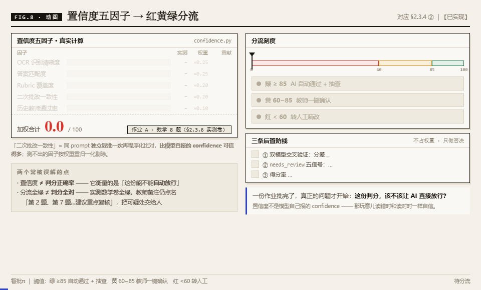
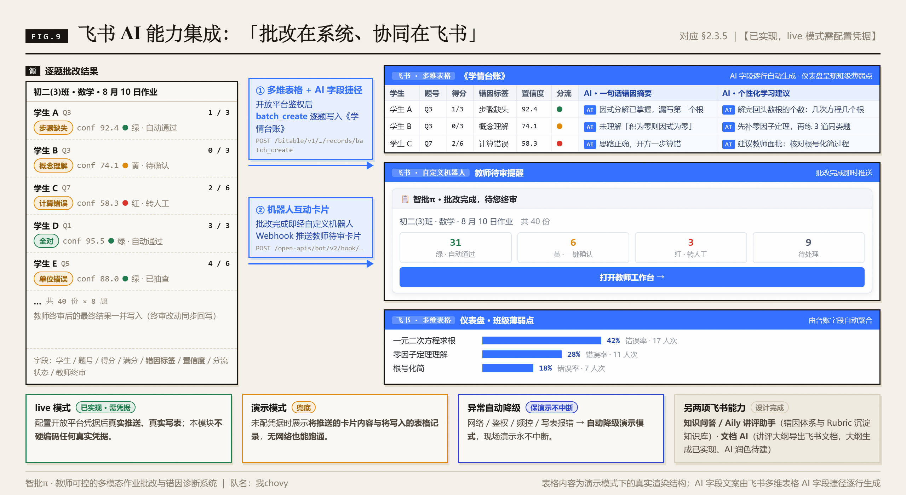
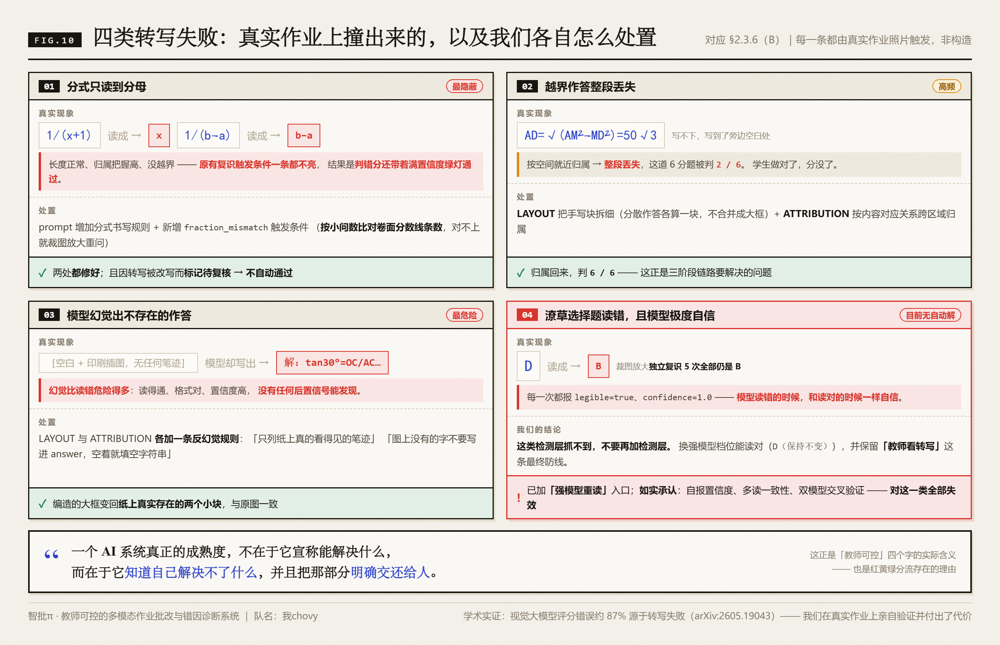

# 【40强赛】视源股份🤝我chovy｜智批π：教师可控的多模态作业批改与错因诊断系统

> 赛道：希沃智教π「不漏一题，不落一人」｜提交日期：2026-08-1X
>
> **本方案的一条自律**：文中凡标【已实现】的，公开链接上点得到；凡标【设计完成】的，明确写"尚未实现"；凡是实测数字，都注明是哪一次跑、什么条件下跑出来的。**我们不把设计说成已实现，不把模拟数据说成实测数据。**

---

## 一、参赛方案信息卡【必须包含】

| 项目 | 填写内容 |
|---|---|
| **队名** | 我chovy |
| **命题** | 视源股份（希沃）· 希沃智教π：「不漏一题，不落一人」——AI 智能作业批改系统 |
| **一句话摘要** | 普通 AI 批改回答「这道题对不对」，**智批π 回答「学生为什么错、错在哪一步、老师敢不敢信这个判断、下一步怎么补、下节课怎么讲」**——把批改从结果判分升级为教师可控的过程诊断与教学闭环。 |
| **成员介绍 & 分工** | **赵浩锋**（汕头大学 · 机械工程 · 第一负责人）——场景与算法：理科过程题批改节点建模、十类错因标签体系与评分细则、批改指令设计与调优、批改样例与测试集建设。 **郑文旭**（中山大学 · 集成电路工程）——识别与流程：图像预处理与版面分析、多模态识别三阶段链路选型调优、红黄绿置信度分流实现、学情看板逻辑、识别与批改质量评测。 **郑凯鹏**（西安电子科技大学 · 计算机技术）——系统工程：前后端与数据库、API 实现、模型接入与飞书开放平台集成、Docker 公网部署与风控、工程质量保障。 三人专业恰好对应系统三条技术主线：**理科场景建模 → 识别与流程链路 → 系统工程实现**；依跨校组队规则，第一负责人为赵浩锋（汕头大学）。 |
| **使用的飞书 AI 能力** | **① 多维表格 + AI 字段捷径**（主用）：批改结果逐题写入《学情台账》，AI 字段自动生成"一句话错因摘要"与"个性化学习建议"，仪表盘呈现班级薄弱点【已实现，live 模式需配置凭据】 **② 机器人互动卡片**：批改完成即推送教师待审卡片（红黄绿统计 + 一键跳转审核台）【已实现】 **③ 知识问答 / Aily 讲评助手**：错因标签体系、评分细则与学情报告沉淀飞书知识库，教师在飞书内问答获取讲评建议【设计完成 · 入围后随企业教练搭建】 **④ 文档 AI**：讲评课件大纲一键导出飞书文档、AI 润色后供教研组协作批注【部分实现：大纲生成已实现，文档 AI 润色待建】 |

---

## 二、方案成果展示【必须包含】

### 2.1 命题场景描述、问题描述及痛点说明

#### 2.1.1 真实场景：一位初中数学老师的周三晚上

命题给的场景我们没有改写，因为它已经足够真实：**一个班 40 份作业，每份都需要判对错、写评语、分析薄弱点。**

把这句话展开成一位真实教师的动作序列，就是下面这张图——**判分独占 150 分钟，评语被挤成模板，学情分析根本没发生**。

> **图 1｜同一个周三晚上。** 上半是今天绝大多数老师的常态：21:00 收上 40 份，逐份逐题判公式、判代入、判单位、判"部分对给几分"，23:30 才判完；此时写评语只剩十分钟，于是只能写「继续加油」；学情分析时间归零，明天讲什么全凭印象。下半是同一个晚上用智批π：AI 批改的 20 分钟教师无需值守，教师只精改红黄桶 + 抽查绿桶，**实际动手约 44 分钟**，剩下的时间还给老师，而学情看板与讲评大纲已经就绪。

**三处结构性损耗**：判分是重复劳动（可自动化却没自动化）；评语被时间挤成模板（最该个性化的环节最先失守）；学情分析被完全牺牲（最有教学价值的环节根本没发生）。

#### 2.1.2 痛点与影响（带来源）

| 痛点 | 事实与来源 | 对业务的实际影响 |
|---|---|---|
| **教师工时严重超标** | "双减"后义务教育教师平均每天工作 **13.75 小时**，超出法定工时约 72%（中国教育学会 / 首都师范大学课题组，基于 2023 年全国 11 省 12 市调查，2024） | 批改是这 13.75 小时里最刚性、最难压缩的一块 |
| **批改被挤到下班后** | **88.7%** 的教师反映课后服务后工作量明显增加（中国教育科学研究院，全国 7 省 28 市调查，2025） | 教师疲劳判分 → 判分质量下降 → 评语进一步模板化 |
| **"双减"抬高了批改的质量要求** | 作业总量下降但设计负担与难度上升，个性化、分层化成为主流诉求（华东师大课题组，转引自北大教育财政所简报 2024） | 老师需要的不只是"批得快"，是"批得细、讲得准" |
| **学生只拿到"错了、扣分、重做"** | 学生无法回答：我哪一步错了？是概念不懂还是计算粗心？先补哪个知识点？ | "改了还错、错了再改"的低效循环 |
| **学校 / 教研拿不到结构化学情** | 班级薄弱点、共性错误、高风险学生名单靠人工统计，颗粒度粗、时效差 | 精准教学缺少数据底座 |

规模底座：全国义务教育阶段在校生 **1.6 亿人**（中国政府网，2024）。1.6 亿 × 每日多科作业，这是一个天然高频、刚性、海量的需求。

---

### 2.2 方案优势 / 创新点

#### 2.2.1 先看效果：方案跑出来长什么样

> **图 2｜三块真实界面（公网站点实截，非设计稿）。** ① **一份作业**：逐评分点判分，每一步都引用学生卷面原文，右侧是置信度五因子明细与教师终审入口；② **全班队列**：红黄绿分流把作业排好序，老师一眼知道该看哪几份；③ **班级学情**：薄弱知识点、错因分布与红黄绿占比自动聚合，并可一键生成讲评课件大纲。

#### 2.2.2 几句话说清亮点

- **业务覆盖**：K12 **数学 / 英语 / 语文 / 物理**多学科，**整页试卷一次批完**（不是一题一题喂），支持图片与 **PDF 多页**、批量流水线；覆盖客观题与理科过程题两类判分逻辑。
- **AI 能力的非常规用法**：把"识别"本身做成了**三阶段 AI 链路**（版面解析 → 内容归属 → 定向复识），并让**强模型只做小图复识、常规模型做整页**——这是我们在真实作业上撞了三轮墙之后的架构决定，不是设计图上的漂亮框。
- **核心突破点**：**把不确定性变成可运营的人机分工。** 置信度五因子真实计算 → 红黄绿分流 → 教师终审 → 通过率回灌，形成闭环；另设**双模型交叉验证一票否决**与**待复核后置防线**，AI 没把握就闭嘴。
- **可验证性**：全流程**可自行复现**——本地一键启动或 Docker 一键上线，公网体验链接见 §2.5；实测跑批的逐题结果、置信度明细、批改痕迹图全部可下载核对；评测方案**预注册**（口径先写进代码，数据到位只执行不改口径）。
- **量化价值**：单份 AI 直接成本 **约 2 分钱**（估算上界），教师每班每次省时价值约 ¥60–120，**价值/成本约百倍量级**（口径见 §2.4.2）。

#### 2.2.3 Before / After：同一个班 40 份作业，三条路径

> **图 3｜三条路径的流程与量化价值对比。** A 纯人工：约 150 分钟，判分挤掉评语、评语挤掉学情。B 市面主流 AI 批改工具：把"批得快"做到了极致（同类产品官方口径：每班约 90 → 约 5 分钟，科大讯飞 2024），但转写藏在管线里、没有逐份可信度标识，**老师不知道哪些该信**——要么全信（有风险），要么全查（没省时）。C 智批π：教师实际动手**约 44 分钟**（AI 那 20 分钟无需值守），拿到的是过程级判分 + 每步证据引用 + 红黄绿分流 + 班级讲评闭环。

**一句话概括三者差别**：A 最可信但最贵；B 省下的是老师的手，没解决老师的心；**C 想解决的正是"老师敢不敢把判分权交出去"**——办法不是让 AI 更聪明，而是让 AI 学会承认自己不确定，并把不确定的那部分明确交还给人。

---

### 2.3 具体方案说明（突出 AI 能力）

#### 2.3.1 三个判断：这决定了我们做什么、不做什么

**判断一：赛道稀缺的不是「批得快」，是「批得准 + 老师敢用」。**
"批得快"已被做到极致（科大讯飞星火智能批阅机把每班人工批改从约 90 分钟压到约 5 分钟、试题解析准确率 >99%，官方 2024；小猿口算 2019 年即日批超 2 亿道）。但**快只解决了老师的手，没解决老师的心**：老师不敢把判分权完全交给一个不知道什么时候会错的黑盒。命题里"真正做到每个学生都被认真对待"，指向的是诊断深度与教师信任，不是吞吐量。

**判断二：多模态批改真正的失败点在「转写」，不在「评分」。**
学术实证显示，视觉大模型的评分错误中约 **87% 源于转写失败**而非评分逻辑错误（arXiv:2605.19043）。**这个判断我们在真实作业上亲自验证过，并且付出了代价**（见 §2.3.7）。它直接决定了架构：转写必须**可见、可编辑、可复识、可度量**，而不是藏在管线里。

**判断三：批改数据的终点不是分数，是下一节课。**
一次批改如果只产出分数和评语，价值在交卷那一刻就结束了。我们把它继续往下推一层：错因画像 → 班级薄弱点 → 讲评建议 → 讲评课件大纲 → 补救练习。**这也是这套系统对希沃最有协同价值的地方**——希沃已有白板、展台、AI 授课助手，缺的是把"课后批改"和"课前备课"接起来的那根数据管道。

> 一句话：命题的考点不是「能不能自动批」，而是**「批得准、老师敢用、学生能改、教学能闭环」**。

#### 2.3.2 端到端流水线总览【已实现】

下图是全链路：**七个环节，五个用到 AI**（图中蓝底方块标出了每一环具体用的是哪种 AI 能力）。

> **图 4｜端到端流水线全貌。** 两个入口并行——① 教师答案页用**多模态大模型**（VLM，能直接看图的 AI）逐题抽取建题库；② 学生作业页走**三阶段识别链路**（同一个多模态模型连调三次，分别做版面解析、内容归属、定向复识）。两条线按题干相似度对齐后，③ 由**大语言模型**（LLM）一次调用批完整页、逐评分点给分；④ 置信度五因子加权分流红黄绿，并由**第二个模型交叉验证**做一票否决；⑤ 教师终审是**唯一的人工环节**，其结果回灌置信度；⑥ 班级看板与讲评大纲由大语言模型生成；⑦ 飞书**多维表格 AI 字段捷径**逐行生成错因摘要与学习建议。

#### 2.3.3 创新点一：把"识别"做成三阶段 AI 链路，而不是一次 OCR【已实现】

这是本方案与常规"OCR（图像文字识别）→ 判分"管线最大的结构差异，也是判断二的直接工程化。

> **图 5（动图）｜同一页作业依次走过三个阶段。** ① 版面解析只做定位，把分散作答拆成 4 个独立手写块，不合并成大框；② 内容归属按**内容对应**把写到题 3 作答区之外的 `AD=√(AM²-MD²)=50√3` **跨区域归属**回题 3（若按空间就近，这一整段会丢失，实测判 2/6）；③ 分式缺分子触发定向复识，裁图放大重问，把只读到分母的 `x` 修正为 `1/(x+1)`，并因转写被改写而标记待复核。**转写结果教师可见、可编辑、可复识之后，才进入批改。**

| 阶段 | 做什么 | 解决什么失败 |
|---|---|---|
| **A. 版面解析** | 让模型先只做一件事：列出这一页有哪些题、有哪些手写块（一道题的作答分散在几处就各算一块，不合并成大框） | 整页长指令一次做完，模型会把小问 (1)(2)(3) 拆成十几个独立"题"，直接打崩题库对齐 |
| **B. 内容归属** | 按**内容对应关系**而非空间就近，决定每块手写属于哪道题 | **越界作答**：学生写不下写到旁边空白处，就近归属会归错题甚至整段丢失 |
| **C. 定向复识** | 对可疑题裁出局部放大图**单独再问一次**，就地修正转写。触发条件：空答、单字符、低归属把握、越界、**分式分子缺失**、**选择题转写落不到选项字母** | 整页归属阶段容易丢分式分子；局部放大能读对 |

**三条工程上的硬结论（都来自真实作业实测，不是设计推演）：**

1. **冗余必须放在转写层，不能只放在评分层。** 我们原本的二次批改、交叉验证全在评分层——**转写错了，评分层再怎么冗余都发现不了**。三阶段是把冗余前移。
2. **强模型不能读整页，只适合小图复识。** 实测：常规模型整页 18.4 秒正常出题；换强模型接管归属阶段 **504 超时**（两次独立复现）。所以最终设计是版面/归属走常规模型，**只有定向复识和「强模型重读」按钮换强模型**——界面上给了单份「强模型重读」与批量「全部增强批改」两个入口。
3. **模型给的文字框坐标不可信，不能拿它做几何判断。** 实测有一整栏横写单词填空被报成宽 1%–8%、高 33%–48% 的竖条。我们据此写过的"侧写检测"误触发 8 次，**已整体撤除**；现在只保留形状合理性检查——形状离谱的框不参与复识裁图。

任一阶段失败自动降级回单次调用，可一键关闭三阶段。另有拍摄朝向统一拉平（横置拍摄的卷子曾导致批改痕迹整体错位，已在入口统一处理）。

#### 2.3.4 创新点二：教师答案页建题库，让"答案匹配度"这一维真的可算【已实现】

真实作业几乎必然在任何预置题库之外。我们的解法是**让教师把答案页拍进来**。

> **图 6｜从答案页到题库，以及"不按题号对齐"。** 教师上传答案页（图片 / PDF，PDF 自动按页拆开）→ 多模态模型逐题抽出「题号 / 题干 / 标准答案 / 题型 / 分值」建成本次会话题库。卷面没印分值的题**按题型推定**（选择填空 2 分、翻译 4 分、解答 6 分），界面明确标注「系统推定 · 教师可改」，改后自动重建该题评分细则。右侧是关键机制：学生页与答案页**按题干相似度对齐，不按题号**——实测语文的教师页是答案册、学生页是练习册，版式完全不同，仍对上 **16/20** 题；对不上的题**照批，但不计入答案匹配度**（若按 0 分计，等于用"没对上"惩罚学生）。

**没有题库也能用**：由大模型自行按五维判别体系判分，置信度里"答案匹配度"这一维**留空并显式标注「无题库 · 权重已重归一化」**，不静默略过、也不当 0 分白扣。

#### 2.3.5 创新点三～五：过程级证据链、红黄绿分流、错因画像与教学闭环【已实现】

**① 过程级证据链批改。** 把理科题拆成"题意理解→公式选择→数值代入→单位检查→最终答案"等评分点，**每步判分都引用学生作答原文**。**给过程分而不是"答案不全判 0"**：解法 2 分 + 因式分解 3 分全给，漏根一步保留部分分 1 分，结论不完整 0 分，总分 6/10。字迹无法辨认时系统如实标注"字迹难辨"并压低置信度转人工，**而不是猜**。

> **图 7｜过程级证据链的完整一题。** 左侧是系统自动叠加在学生原卷上的批改痕迹（可下载可打印）；中间是逐评分点判分，**每一步都引用学生作答原文**——判"步骤缺失"引的就是卷面那行 `x=2`，判定依据可回溯、教师可核实、学生可申诉；右侧是两层错因标签与三段式评语。

**关键工程细节**：客观题（选择/填空/判断）走硬拦截——拿到"步骤缺失""过程不规范"这类步骤扣分会被自动清除，得分按对/错二值修正，**不允许出现过程分中间值**。填空题被误扣步骤分是我们实测发现并修掉的真实问题。

**② 红黄绿置信度分流（裁决权始终在教师）。**

| 因子 | 权重 | 它在防什么 |
|---|---|---|
| 识别清晰度 | 0.25 | 防"字没认对却硬判分"；可疑题数会**反向扣减**该维（每题 12 分，上限 40） |
| 答案匹配度 | 0.25 | 防"终答对不上还给高分"；**仅在有题库时计分**，无题库按权重重归一化剔除 |
| 评分点覆盖度 | 0.20 | 防"评分点没覆盖全就下结论" |
| 二次批改一致性 | 0.20 | 防"模型一次说对一次说错"——同指令独立复批一次程序化比对，**比模型自报把握度可信得多** |
| 历史教师通过率 | 0.10 | 老师每一次终审都反向校准这道题以后的可信度 |

阈值：**≥85 绿（自动通过 + 抽查）｜60–85 黄（教师一键确认）｜<60 红（转人工）**。三条后置防线不占权重、只做否决：双模型交叉验证分差 > 满分 15% **一票否决转人工**；待复核五信号命中则**压住绿灯并在教师备注里点名到题**（例如"本页别的题都答了、唯独这道空着"）；得分率 < 60% 不自动通过。

> **图 8（动图）｜从五因子到人机分工的完整一轮。** 前半段：五个因子各自独立测量、加权求和 92.4 → 落入绿桶 → 三条后置防线全部通过 → 自动放行。后半段换一份**同样是高分**的作业：89.8 本已落绿桶，但双模型交叉验证分差 18% > 满分 15%，**一票否决、绿灯作废、转人工**；教师终审后，该题的「历史教师通过率」因子被回灌校准（82 → 79），闭环合上。图中因子分值为示意拆解，合计 92.4 对应 §2.3.7 实测数学卷的置信度。

**③ 两层错因标签 + 学生长期画像。** 不止"哪个知识点错得多"，而是"**为什么**错"——概念理解、公式选错、计算错误、单位错误、审题偏差、图形误读等**十类枚举**（不允许模型自由发挥造标签）。学生画像跨题聚合本次错因，叠加历史时间线给出趋势判断（**历史时间线为模拟数据，界面已显著标注**）。

**④ 批改→讲评→补救→复测教学闭环。** 班级看板出薄弱点、知识点错误率与错因分布、红黄绿占比、下节课讲评建议；「讲评课件大纲」一键生成（共性错因 + 匿名典型错例 + 分层任务 + 5 分钟复测建议），**可直接粘进希沃白板 / 飞书文档做备课底稿**。

#### 2.3.6 飞书 AI 能力集成：「批改在系统、协同在飞书」【已实现，live 需凭据】

| 集成点 | 飞书能力 | 作用 | 状态 |
|---|---|---|---|
| **学情台账（主用）** | **多维表格 + AI 字段捷径** | 逐题批改结果（学生/题号/得分/满分/错因标签/置信度/分流状态/教师终审）经开放平台鉴权写入《学情台账》；**AI 字段逐行自动生成"一句话错因摘要"与"个性化学习建议"**，仪表盘呈现班级薄弱点 | 【已实现】 |
| **审核流转** | **机器人互动卡片** | 批改完成即推送教师待审卡片（作业名 + 红黄绿统计 + 待处理数 + 一键跳转审核工作台） | 【已实现】 |
| 讲评助手 | 知识问答 / Aily | 错因标签体系、评分细则与学情报告沉淀知识库，教师在飞书内问答获取讲评建议 | 【设计完成 · 入围后实施】 |
| 讲评提纲 | 文档 AI | 讲评大纲导出飞书文档、AI 润色后供教研组协作批注 | 【部分实现：大纲生成已实现】 |

> **图 9｜两条集成路径与双轨运行。** 未配置凭据时为**演示模式**——展示将推送的卡片内容与将写入的表格记录，无网络也能跑通；配置凭据后为 **live 模式**真实推送、真实写表，任何异常（网络/鉴权/频控/写表报错）**自动降级演示模式**，保证现场演示永不中断。本模块不硬编码任何真实凭据。右下角标注了两项**【设计完成】尚未实现**的能力，未与已实现部分混同。

#### 2.3.7 实测证据：我们如何验证"失败主要在转写"

**（A）三科真实作业端到端实测**（2026-08-10，真实链路：多模态识别 + 大模型整页批改 + 题库比对 + 原图留痕）

| 学科 | 题库题数 | 识别题数 | 对上题库 | 拿到坐标 | 得分 | 置信度 | 分流 | 耗时 |
|---|---|---|---|---|---|---|---|---|
| 数学 | 8 题 / 36 分 | 8 | 7 | 8/8 | 33.5 / 36.0 | 92.4 | green | **23 秒** |
| 英语 | 28 题 / 56 分 | 28 | 27 | 28/28 | 56.0 / 56.0 | 95.5 | green | **25 秒** |
| 语文 | 49 题 / 106 分 | 20 | 16 | 20/20 | 36.0 / 46.0 | 88.4 | green | **36 秒** |

**这张表的四条如实说明**（我们认为这比表本身更重要）：

1. **分值几乎全是系统推定的**——三科教师页都没印分值，整页总分是**推定口径**不是卷面分，界面已标"系统推定，教师可改"；
2. **对齐不是 100%**——语文教师页是答案册、学生页是练习册，题干相似度对上 16/20，对不上的题照批但不计入答案匹配度；
3. **分流全绿 ≠ 判分全对**——置信度衡量的是"这份能不能自动放行"，不是"判分有没有错"。实测中数学的教师备注直接写了"第 2 题、第 7 题涉及特殊角三角函数值记忆偏差，建议重点复核"，**这正是这套东西该做的事：把可疑处交给人**；
4. **整页批改的粒度是「页」不是「册」**——语文只识别出 20 题而题库有 49 题，因为教师答案页覆盖范围比学生这一页大；多页作业要逐页批。

**（B）四类转写失败的真实案例与处置**（每一条都由真实作业照片触发，非构造）

> **图 10｜四类转写失败，以及我们各自怎么处置。** 前三类都修好了：分式只读到分母（最隐蔽——旧触发条件一条都不亮，判错分还带满置信度绿灯）、越界作答整段丢失（2/6 → 6/6）、模型幻觉编造不存在的作答（最危险——读得通、格式对、没有任何后置信号能发现）。**第四类目前无自动解**：潦草选择题读错且模型极度自信，独立复识 5 次全部同一个错答、每次都自报"字迹清晰、把握度 100%"。

| 失败类型 | 真实现象 | 处置 | 结果 |
|---|---|---|---|
| **分式只读到分母** | 学生写 `1/(x+1)` 读成 `x`、写 `1/(b-a)` 读成 `b-a`。**最隐蔽的一类**：长度正常、归属把握高、没越界，原有复识触发条件一条都不亮，**判错分还带满置信度绿灯通过** | 指令加分式规则 + 新增"分式缺分子"触发（按小问数比对分数线数） | 两处都修好，且因改写被标待复核 → 不自动通过 |
| **越界作答整段丢失** | 学生写不下，把 `AD=√(AM²-MD²)=50√3` 写到旁边，整段丢失，判 2/6 | 版面阶段拆细手写块 + 归属阶段按内容对应 | 归属回来，判 6/6 |
| **模型幻觉出不存在的作答** | 模型报告的手写块区域内**没有任何笔迹**，只有印刷插图与空白，模型照着题目**编了一段** `解：tan30°=OC/AC…`。**幻觉比读错危险得多**——读得通、格式对、把握度高，没有任何后置信号能发现 | 版面 + 归属两个指令各加反幻觉规则："只列纸上真的看得见的笔迹""图上没有的字不要写进答案，空着就填空" | 编造的大框变成两个真实小块，与原图一致 |
| **潦草选择题读错且模型极度自信** | 学生写 `D`，模型读 `B`；裁图放大**独立复识 5 次全部仍是 B**，每次都自报"字迹清晰、把握度 100%" | **我们的结论是：这类检测层抓不到，不要再加检测层**。换强模型能读对，并保留"教师看转写"这条最终防线 | 已加「强模型重读」入口；如实承认自报把握度、多读一致性、双模型交叉验证**对这一类全部失效** |

> **最后一条是我们最想让评委看到的一条。** 一个 AI 系统真正的成熟度，不在于它宣称能解决什么，而在于它**知道自己解决不了什么，并且把那部分明确交还给人**。这也正是"教师可控"四个字的实际含义。

**（C）工程可靠性**：分层降级（大模型失败→规则引擎并明确标注；飞书失败→演示模式）；**识别失败不伪造降级**——内置样例已换成真实作业原件，没有"预置转写"可兜底，未配密钥或额度用尽时页面直说识别不可用并指路可看的三屏，而不是拿一个假结果冒充跑通；网关瞬时故障重试（**含连接被重置一类**——原实现只重试"收到响应但报错"，连接被重置一次都不重试，批量跑必挂）；公网部署自带**访问口令 + 单 IP 限流 + 每日调用配额 + 只读根文件系统 + 非 root**四道风控；前端**零外部请求**（答辩断网预案）。

---

### 2.4 方案价值

#### 2.4.1 对教师：省时 + 省心

| 环节 | 纯人工 | 智批π | 说明 |
|---|---|---|---|
| 判分 | 40 份 × 5 题 × 45 秒 ≈ **150 分钟/班次** | 机器 23–36 秒/份（实测），教师只精改黄红桶 + 抽查绿桶 ≈ **约 44 分钟**（估算） | 每班每次**净省约 1.5–2 小时**（估算） |
| 评语 | 时间不够 → "继续加油" | 逐份定位到具体错误步骤，同错因不同学生措辞不同 | 质量提升，不只是省时 |
| 学情分析 | 基本不发生 | 自动出薄弱点 + 错因分布 + 讲评大纲 | **从 0 到 1** |

方向上与学界实证（AI 辅助省时 23%–33%，arXiv 2024/2026）与讯飞校端案例（重复批改时间减少约 80%）一致。**我们自己的省时率以人工计时实测为准（半分交叉平衡设计，尚待完成，见 §2.4.4）。**

#### 2.4.2 单位经济：教师时间价值与 AI 成本相差约两个数量级

> **单份作业 AI 直接成本**（保守上界，缓存未命中）：识别 1 次 + 批改 2 次（含二次一致性）≈ **¥0.019 ≈ 约 2 分钱 / 份**
>
> **每班每次**：AI 成本 ≈ **¥0.6~0.8**　｜　省时价值 ≈ 1.5~2h × ¥40~60/h ≈ **¥60~120**
> → 价值 / 成本 ≈ **75~200 倍**，量级结论：**百倍级**（估算）
>
> **每班每学期**：省时 **150~200 小时**（折算 ¥6,000~12,000），AI 成本仅约 **¥60~80**

规模阶梯（¥0.02/份、40 人/班保守估算）：1 个班/学期约 ¥80；一所 2000 人学校/学年单学科约 ¥8,000、三科约 ¥2.4 万；10 万学生区县/学年单学科约 ¥40 万、三科约 ¥120 万。**模型直接成本占定价比例可控制在三成以内**，定价空间主要由渠道、服务与信任决定——而"教师可控"设计换来的学校信任，正是这套单位经济能兑现的前提。

#### 2.4.3 对希沃：增强而非替代

希沃教学大模型 2.0（备案名 CVTE 大模型）支持边缘/本地部署，AI 授课助手已覆盖智能切题、自动批改、相似题推荐、自动生成讲解板，产品覆盖超 280 万间教室、服务教师超 800 万（希沃官方，2024）。**希沃现有批改偏"题目识别 + 讲评辅助"，而"过程级错因诊断 + 红黄绿教师可控审核 + 学生长期画像 + 班级教学闭环"正是其自然的下一步增强方向。** 三个具体接入点：

1. **采集端**：希沃展台 / 高拍仪即为天然的作业采集入口，不必新增硬件；
2. **讲评端**：讲评课件大纲直接输出为希沃白板可用的备课底稿，把"课后批改"接到"课前备课"；
3. **端侧**：识别与轻量判分链路具备在交互智能平板上做本地化推理的空间（合规上也更优）。

#### 2.4.4 可推广性与诚实边界

**可推广**：错因标签体系与评分细则结构跨学科同构（已覆盖数学/英语/语文/物理四科，扩科主要是配置而非改代码）；教师答案页建库使系统**不依赖预置题库**，换一所学校、换一套教辅即可开工；三阶段部署路径为 试点班（2–4 周免费换实测数据）→ 全校（按班/年 SaaS）→ 区县（项目制 / 共享私有化）。

**我们尚未做到的（如实声明）**：

1. **实测评测报告仍是空表**——字符错误率、AI 与教师判分一致率、一致性系数、分桶教师认可率、省时率均**待人工双评盲评数据填充**。评测方案已**预注册**（指标定义、判定阈值、分桶口径全部先写进代码常量，数据到位只执行不改口径，防止事后挑指标）。**我们宁可交一张空表，也不填一个没测过的数字。**
2. **双评者为团队成员而非在职教师**，该局限已在评测方案中声明；
3. **学生画像的历史时间线为模拟数据**，界面已显著标注；
4. **潦草选择题的转写失败目前无自动解**（见 §2.3.7 案例四），只能靠教师看转写或换强模型。

---

### 2.5 方案体验入口 & demo 展示视频【建议包含】

**体验入口（公网链接，提交前补齐）**

- 地址：【待补充：公网体验链接，形如 `https://<域名>/?code=<访问口令>`，链接中已带访问口令，评委打开即进，无需注册、无需安装】
- 备用测试口令：【待补充】（口令即凭证，无需账号；链接可转发，没口令打不开）
- **建议动线（约 5 分钟）**：
  1. **① 拍照提交 → 教师页·建题库**（可选但推荐）：上传一张教师答案页（图片或 PDF），系统逐题抽出标准答案与分值建库，卷面没印分值的会标"系统推定"，可当场改；
  2. **① 拍照提交 → 学生页·上传批改**：上传学生作业照片 / PDF（≤8MB，多页 PDF 会出缩略图选页），先看**识别结果与转写文本**（可直接改），再点「批改整页」；字迹潦草时可点「强模型重读」；多份一起拖入会自动进批量流水线；
  3. **② 批改结果**：最上方是**批改痕迹图**（学生原卷上叠加 ✓/半勾/✗ 与得分，可下载），往下是逐题得分、置信度五因子明细、逐评分点证据链、错因标签与个性化评语；
  4. **③ 教师工作台**：红黄绿队列 → 打开终审弹窗改分 / 改错因 / 改评语 → 看"该题教师通过率回灌置信度"提示；
  5. **④ 班级看板**：薄弱点与错因分布 → 一键生成**讲评课件大纲**并复制 → **飞书协同**：推送审核卡片 + 同步多维表格学情台账。
- **测试账号**：无需账号，口令即凭证。
- **风控说明**：站点带访问口令、单 IP 限流与每日调用配额（保护 API 余额），触发限流时会明确提示而非静默失败；若遇配额用尽，识别会**明确告知今日额度已用尽**并指路仍可查看的批改结果 / 教师工作台 / 班级看板三屏——内置样例是真实作业原件，没有预置转写可以兜底，我们不拿假结果冒充演示成功。
- **现在就能复现（无需等公网链接）**：一键启动脚本或标准 `pip install` + `uvicorn` 启动，默认离线模式**免任何 API Key** 可跑通全流程；配置识别 / 批改密钥后即为真实大模型链路。Docker 一键上线见 `deploy/README.md`（含口令、限流、配额、只读根文件系统、非 root）。

**demo 展示视频（3–5 分钟）**

- 链接：【待补充：录制后贴飞书妙记 / B 站 / 抖音公开链接】
- **完整分镜脚本、口播逐字稿、录制 checklist 与诚实红线见 `docs/12-demo视频脚本与录制方案.md`**，目标时长 4 分 20 秒，八个镜头：

| 镜头 | 时间 | 内容 | 落点 |
|---|---|---|---|
| S1 | 0:00–0:22 | 教师周三晚上：40 份 / 150 分钟 / 评语退化 / 学情归零 | 老师不敢把判分权交给黑盒 |
| S2 | 0:22–1:00 | 教师答案页建题库，分值「系统推定 · 教师可改」 | 不依赖预置题库 |
| S3 | 1:00–1:50 | 三阶段识别：越界作答跨区域归属、分式定向复识、强模型重读 | **转写可见 · 可编辑 · 可复识** |
| S4 | 1:50–2:40 | 整页一次批完（实测 23 秒）、原卷批改痕迹图、逐评分点证据 | 给过程分，不是"答案不全判 0" |
| S5 | 2:40–3:20 | 置信度五因子明细 → 红黄绿队列 → 教师终审 → 通过率回灌 | 三条后置防线只做否决 |
| S6 | 3:20–3:55 | 班级看板薄弱点 → 一键生成讲评课件大纲 → 复制为备课底稿 | 批改数据的终点是下一节课 |
| S7 | 3:55–4:20 | 飞书审核卡片推送 + 多维表格 AI 字段逐行生成 | 批改在系统、协同在飞书 |
| S8 | 4:20–4:40 | 潦草选择题：复识 5 次全错、模型仍报"把握度 100%" | **主动讲清我们解决不了什么** |

- **录制自律**：视频只演示【已实现】功能；模拟数据（学生画像历史时间线）、演示模式（飞书未配凭据）、加速剪辑**一律在画面上标注**；识别失败就展示真实的"识别不可用"提示并切镜，**不拿预置转写冒充跑通**；视频里出现的每个数字都对得上本文档的口径。

---

## 三、自由展示区【可选 · 加分项】

### 3.1 技术架构详解

浏览器端是单页前端（原生 HTML/CSS/JS，**零外部请求、零外链字体**，答辩断网也能跑）；服务端是 FastAPI 单体应用，业务能力按流水线模块拆分：

| 模块 | 职责 | 对应接口 |
|---|---|---|
| **PDF 拆页** | PDF → 每页 JPEG（150 DPI）| `/api/upload-pages` |
| **识别** | 三阶段识别 + 定向复识 + 强模型重读 + 拍摄朝向拉平 | `/api/recognize-image` |
| **题库** | 答案页建库 / 分值推定 / 题干相似度对齐（不按题号）| `/api/bank/build｜list｜{id}/score` |
| **整页批改** | 一次调用批完整页 + 客观题硬拦截 + 待复核五信号 | `/api/grade-page` |
| **原卷留痕** | 学生原图上渲染 ✓ / 半勾 / ✗ / 得分 | `/api/page/{id}?marked=1` |
| **逐步判分** | 评分细则逐点判分 + 证据引用 + 二次批改一致性 + 双模型交叉验证 | `/api/grade-image` |
| **置信度** | 五因子加权 + 重归一化 + 红黄绿分流 | （随批改返回）|
| **教师工作台** | 终审改分 / 改错因 / 改评语，结果回灌置信度 | `/api/teacher/results｜review` |
| **学情** | 班级聚合 + 学生错因画像 + 讲评大纲 | `/api/analytics/class｜student/{id}｜lecture-outline` |
| **飞书** | 互动卡片 / 多维表格台账（live 与演示双轨）| `/api/feishu/push｜sync-base` |
| **风控** | 访问口令 / 单 IP 限流 / 每日调用配额 | `/api/demo/config`、`/healthz` |

状态分层：AI 批改基线只读，教师终审、上传件与题库按会话隔离，页图与痕迹图按会话隔离并按最近使用回收。

**技术选型要点**：识别与批改均走 **OpenAI 兼容接口**，模型可插拔（识别默认 `qwen-vl-max`，实测亦跑通轻量档 + 强档双档位组合；批改默认 DeepSeek 系）；**优先选可私有化部署的国产大模型**，为校内部署与数据不出校留路；PaddleOCR 为生产化识别的备选选型（设计完成）。

### 3.2 我们在真实作业上学到的五件事（工程复盘）

1. **静默降级是最危险的失败模式。** 配了密钥 ≠ 生效。我们踩过"进程先启动、配置后修改"导致界面上的"强模型"其实是旧档位的坑。现在启动横幅明确打印当前模式，且任何数字进答辩材料前必须先查接口确认真的在跑大模型。
2. **三处各自看都对，合起来是错的。** 前端在两处送批载荷里按一份手写的字段清单重建对象，把题型、越界、复识等元信号**全截断了**——服务端接收位和批改端消费逻辑都是好的，**三阶段识别的元信号一个都没进批改**。已抽成单一函数。
3. **模型档位常常才是主因，指令调优是在给弱模型打补丁。** 同一张卷、同一套指令，轻量档把选择题读成学生的推导过程，强档直接读出正确选项。我们此前两轮指令与触发条件的改进，本质是在补轻量档的洞。
4. **"两次读取不一致"不等于"已修正"。** 实测有越改越错的（`x-1 → x`），所以复识改写只作为"这块字迹读不稳"的信号，压低置信度，而不是当成修好了。
5. **前端"源码全对、页面空白/错位"要量渲染后的实际样式。** 分值输入框的固定宽度被后定义的同优先级规则覆盖，题干被挤成每字一行——这类问题读源码看不出来，必须在页面里量。

### 3.3 未来迭代规划

| 阶段 | 重点 | 关键动作 |
|---|---|---|
| **近期（提交后 ~1 个月）** | 把宣称全部变成实证 | 完成 30–50 份真实手写的双评盲评与仲裁，跑通评测脚本填满全部结果表；请 1–2 位在职教师参与判分并产出教师参照行 |
| **中期（1 个学期）** | 试点班闭环 | 1–2 所学校 2–4 个班 2–4 周试点，按预注册口径每周复盘绿灯率 / 教师改动率 / 单份耗时；沉淀校本题库与评分细则；教师工作台的步骤级改判与批量确认落地 |
| **中期技术** | 识别质量与成本 | 主识别换更强档位 / 自研蒸馏小模型；引入 PaddleOCR 做版面与印刷体的确定性兜底；上下文缓存摊薄同班重复输入 |
| **长期** | 规模化与生态 | 区县共享私有化部署；随希沃交互智能平板 / 展台渠道分发；端侧本地推理；飞书教育解决方案模板复用学情台账与审核流转 |

### 3.4 团队与匹配度

| 成员 | 院校 · 专业 | 在项目中负责 | 与命题的匹配 |
|---|---|---|---|
| **赵浩锋**（第一负责人） | 汕头大学 · 机械工程 | 场景与算法：批改节点建模、十类错因标签与评分细则、批改指令调优、样例与测试集、技术答辩 | 理工科建模训练对"过程题解题链路"敏感，能把教学场景翻译成可计算的批改规则 |
| **郑文旭** | 中山大学 · 集成电路工程 | 识别与流程：图像预处理与版面分析、三阶段识别链路选型调优、红黄绿分流实现、学情看板、识别与批改质量评测 | 数字信号与图像处理是本职；硬件背景也为端侧本地推理预留空间 |
| **郑凯鹏** | 西安电子科技大学 · 计算机技术 | 系统工程：前后端与数据库、API、模型与飞书开放平台接入、Docker 公网部署与风控、工程质量 | 全栈与部署能力保障从原型到可演示产品的落地 |

**协作机制**：接口先行（以 API 契约与数据结构为协作边界并行开发）；每周两次同步会（一次对齐进度，一次做批改质量联合评审）；**质量守门**——任何判分规则改动须通过批改样例回归集验证后合入。

### 3.5 合规声明

- Demo 内置 38 份**真实作业照片**（三科学生页 19 份 + 配对教师答案页 19 份），卷面本身不含姓名学号，以匿名编号标识；实测所用真实作业同样已遮盖 / 裁除姓名学号，仅用于本次评测，不入库不外传；
- 学生画像的历史错因时间线为**模拟数据**，界面已显著标注；
- 方案遵循《个人信息保护法》《未成年人网络保护条例》《生成式人工智能服务管理暂行办法》设计，优先选用可私有化部署的已备案国产大模型；进校所需的教育 App 备案与等保二级测评已列入推广路线的前置准备。

---

## 四、附录

### 幕后故事和花絮

**我们最有价值的两周，是在"不加功能"里度过的。**

8 月 4 日命题说明会后，我们给自己定了一条规矩：**接下来两周不加新功能，只把宣称变实证。** 理由很朴素——每加一个功能，就多一个没实测的宣称。

然后真实作业照片进来了，我们被结结实实地教育了一轮。第一轮我们以为是分辨率不够，做了 1800/2400/原图的对照实验，**6 次全部读对**——分辨率不是原因。第二轮以为是指令不够严，加了分式规则、加了触发条件，确实修好了两处。第三轮才发现真正的主因是**模型档位**：同一张卷、同一套指令，轻量档读成 `B`、强档读出 `D`——**我们前两轮的所有努力，本质上是在给一个弱模型打补丁。**

最让我们难受的是那道潦草选择题：学生写的是 `D`，模型读成 `B`，我们裁图放大、独立复识**五次**，五次全部还是 `B`，而且**每一次模型都报"字迹清晰、把握度 100%"**。模型读错的时候，和读对的时候一样自信。我们试过的所有检测手段——自报把握度、多次读取一致性、双模型交叉验证——**对这一类全部失效**。

那天我们做了一个决定：**不再往上加检测层，而是把这件事如实写进文档，并且把"教师看转写"这条路留死。** 这个决定后来变成了整个方案的骨架——**红黄绿分流的本质不是让 AI 更聪明，而是让 AI 学会承认自己不确定。**

还有一次更吓人：模型报告的某个手写块区域里，纸上**根本没有任何笔迹**，只有印刷插图和空白，而模型照着题目**编了一整段解题过程**，格式工整、逻辑通顺、把握度很高。**幻觉比读错危险得多**——读错还可能被后置信号抓到，编造读得通、格式对、什么信号都不亮。我们的处置是在版面和归属两个指令里各加一条反幻觉规则："只列纸上真的看得见的笔迹""图上没有的字不要写进答案，空着就填空"。改完当场生效：一个编造的大框，变回了纸上真实存在的两个小块。

如果这份方案里只有一句话能被记住，我们希望是这句：**一个 AI 系统真正的成熟度，不在于它宣称能解决什么，而在于它知道自己解决不了什么，并且把那部分明确交还给人。**

### 参考项目 & 文献（节选，完整 42 条见项目 `docs/06-参考资料清单.md`）

**学术研究**

1. arXiv:2408.12870 —— AI 辅助批改可将整份答卷批改时间降低约 33%；
2. arXiv:2605.19043 —— 视觉大模型的评分错误中约 **87% 源于转写失败**而非评分逻辑错误（本方案核心技术主张的实证来源）；
3. ACM, 2017 —— Gradescope 用户研究：约 2/3 用户节省 30% 以上批改时间。

**行业与教师负担调研**

4. 中国教育学会 / 首都师范大学课题组（2024）：双减后义务教育教师日均工作 13.75 小时；
5. 中国教育科学研究院（2025）：88.7% 教师反映课后服务后工作量明显增加；
6. 中华人民共和国政府网（2024）：2023 年义务教育阶段在校生 1.6 亿人；
7. 艾瑞咨询（2024–2026）、36 氪研究院（2024）、头豹研究院（2023）：教育智能硬件与 K12 在线教育市场规模。

**竞品资料**

8. 科大讯飞官方 / 中国教育在线（2024–2025）：星火智能批阅机"1 人 3 步 10 分钟"、每班约 90 分钟 → 约 5 分钟、试题解析准确率 >99%；
9. 黑板洞察（2019）：小猿口算日批超 2 亿道；量子位（2025）：小猿 AI 五重错因分析法；
10. 希沃官方（2024）：教学大模型 2.0（CVTE 大模型）、覆盖超 280 万间教室、服务教师超 800 万；
11. Turnitin / Gradescope 官方：动态评分细则与答案聚类，明确"深度语境判断仍需人工"。

**本项目材料索引**

| 材料 | 一句话 |
|---|---|
| `docs/02-详细设计方案.md` | 21 章完整产品与技术设计（定位、五大创新点、架构、数据库、API、风险、合规） |
| `docs/03-行业研究与竞品分析.md` | 市场规模、政策、8 家竞品横评、四个空白点、单位经济与 GTM |
| `docs/04-技术说明文档.md` | 识别方案、知识建模、评语生成策略、置信度实现（对应命题三项交付要求） |
| `docs/05-批改样例与数据分析.md` | 三学科批改样例逐步解读 + 班级学情分析样本 |
| `docs/07-实测评测方案与报告.md` | **预注册**评测方案（口径先入代码，结果表待实测填充） |
| `docs/08-实测踩坑记录.md` | 16 节实测踩坑，全部带实测数字 |
| `docs/12-demo视频脚本与录制方案.md` | 3–5 分钟 demo 视频的八镜分镜、口播逐字稿、录制 checklist 与诚实红线 |
| `docs/assets/` · `tools/figures/` | 本方案 10 张配图 / 动图（图 1–10）及其可重出的 HTML 源与渲染脚本 |
| `prompts/grading_prompts.md` | 过程级批改 / 错因归因 / 个性化评语 / 班级讲评等 6 个生产级指令 |
| `demo/` · `deploy/` | 可运行原型（FastAPI，默认离线模式免 Key）与 Docker 一键公网部署 |

---

> 感谢视源股份与企业教练在命题说明会上的拆解，让我们把"多学科自动批改"这个题目，理解成了"教师敢不敢把判分权交出去"这个问题。
>
> （注：部分内容可能由 AI 生成；文中所有实测数字均来自本项目真实运行记录，逐题明细可追溯。）
