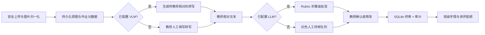

# 智批π旧版审阅与产品化重构报告

审阅对象：`zhipi-submission/demo/` 当前工作区版本。重构目标目录：`zhipi-submission/product/`。旧版存在大量未提交改动，本次没有覆盖、删除或格式化任何旧文件。

## 一、基线结论

旧版的功能深度已经超过普通比赛原型：真实图片校验、EXIF 归一化、三阶段识别、题库对齐、教师终审和飞书协同都已有实现。但这些能力集中在 2,300 余行的 `demo/app.py`、3,100 余行的单页前端和若干进程内全局对象中。它适合单机比赛演示，不适合作为可长期运行的产品直接扩展。

基线检查结果：

- Python 模块可编译，FastAPI 可启动；
- 旧版标准 `pytest` 基线失败：`demo/tools/test_edge_cases.py` 中三个 `test_*` 函数要求不存在的 `eval_dir` fixture，因此被 pytest 收集后直接报错；
- 工作区的 `deploy/.env` 会被非 Docker 直启自动加载，基线 TestClient 请求除 `/healthz` 外均被访问口令拦截，测试环境与开发者进程环境没有隔离；
- Git 工作区在本次开始前已存在大量修改、删除和未跟踪文件，重构因此采用新目录隔离。

## 二、已确认问题与边界

### P0：状态只在单进程内存中

`session_store.py`、`pagestore.py`、`guard.py` 分别保存会话、原图、限流和模型日配额。`docker-compose.yml` 也明确写明只能运行一个 worker，否则终审状态、限流和配额会被 worker 数放大。结果是：

- 服务重启后上传、教师终审和体验文件夹全部丢失；
- 无法水平扩容；
- 进程崩溃没有恢复点；
- 内存回收/TTL 对用户表现为静默重置。

重构：业务状态、教师终审、审计和日配额进入 SQLite；原图进入有界文件存储。SQLite 使用 WAL 和短连接，支持多个 uvicorn worker。

### P0：教师终审缓存写入不原子且吞异常

旧版 `_save_graded_cache()` 直接用 `open(..., "w")` 覆盖 JSON，任何异常被 `except Exception: pass` 吞掉。线程并发或进程中断可能留下截断 JSON；只读容器下写入必然失败但界面无感知。

重构：教师终审与批改元数据使用数据库事务；图片采用临时文件、`fsync` 和原子替换。数据库写入失败会删除对应新文件。

### P0：共享访问口令直接保存在浏览器 Cookie

旧版访问闸门把用户提交的 `supplied` 口令原文写入 Cookie；Cookie 虽是 HttpOnly/SameSite=Lax，但没有根据 HTTPS 设置 Secure。第一次认证还通过 `?code=` 查询参数进入服务器，口令可能被反向代理访问日志记录。

重构：登录改为 POST JSON；浏览器只保存不可逆 HMAC 签名令牌，不保存访问口令；生产环境强制随机签名密钥，HTTPS 可启用 Secure，SameSite 改为 Strict；也支持 Bearer Token 供受控 API 客户端使用。

### P0：全局请求体限制可被 chunked body 绕过

旧版中间件只检查 `Content-Length`。客户端不发送该头而使用 chunked body 时，框架仍会把完整 JSON 读入内存。图片内层虽有 Base64/图像边界，但全局保护并不完整。

重构：ASGI 中间件同时统计实际接收字节；文件存储还会在 Base64 解码前按编码长度二次拒绝。

### P1：单体入口耦合过高

旧版路由、配置、数据加载、批改编排、缓存、会话、HTML 入口和统计逻辑都由 `app.py` 直接组织。增加一个状态字段经常要同时改入口、流水线与前端，回归面难以界定。

重构：按配置、仓储、文件存储、模型客户端、评分归一化、业务服务、统计、API 工厂拆分；`app.py` 只保留兼容导入。

### P1：配置来源污染测试和本地运行

旧版会向上查找并自动加载 `deploy/.env`。仓库内真实部署配置会改变任意 TestClient 或脚本的行为，甚至意外使用真实模型额度。

重构：只读取新项目根目录的 `.env`，环境变量优先；容器完全不读 dotenv；测试直接注入不可变 `Settings.for_test()`。

### P1：异常可能把上游与内部细节返回给用户

部分旧路由直接返回 `"临时批改失败：%s" % exc`。requests 异常可能带网关地址、连接池信息或响应正文。

重构：模型客户端只暴露有限错误类别和 HTTP 状态；未捕获异常在服务端带 request ID 记录，客户端只看到请求编号。

### P1：缺少持久化审计与请求关联

旧版终审记录没有审计事件，也没有统一 request ID。发生“AI 给了多少、教师为什么改、是哪次请求”时难以追查。

重构：每个响应包含 `X-Request-ID`；教师终审写入 `audit_logs`，记录 AI 分、终审分、动作、对象和请求编号。

### P1：模型费用边界只在进程内

旧版日配额由模块字典统计，多 worker 会放大额度，进程重启会清零。

重构：VLM/LLM 分桶日配额由 SQLite `BEGIN IMMEDIATE` 原子占用；生产启用真实模型时不允许把日配额留为无限。

### P1：默认降级容易被误解为真实 AI

旧版部分链路在真实模型失败后降级到 mock；界面仍能出分，容易把规则结果当成模型结果。

重构：内置样例明确标为 mock；新上传作业未配置 LLM 时不自动判分，固定进入红色人工终审，并在 `mode`、教师备注和页面中显式说明。

### P2：学生统计可能按姓名误合并

旧版班级聚合说明中承认批改结果缺少 `student_id`，只能按姓名去重。同名学生会被合并，匿名上传也会聚在同一桶。

重构：持久化 schema 保留 `student_id`，聚合优先使用它；仅在缺失时才回退姓名/作业 ID。

### P2：终审维度非法项被静默丢弃

旧版 `_dimension_deltas()` 对未知维度、非数字和越界分数静默 `continue`。教师以为修改成功，但部分数据可能没有保存。

重构：终审维度名必须来自该次批改步骤，分数必须在对应满分内；非法输入返回 422，避免“看似成功”。

## 三、重构后的关键闭环

## 四、自动化验证覆盖

`tests/test_api.py` 覆盖：

- 存活、就绪与安全响应头；
- 访问口令错误/正确/退出，HttpOnly 与 SameSite=Strict；
- 终审分数和错因枚举边界；
- 终审在应用重启后仍存在；
- 非法 Base64、伪装图片、1×1 图片、路径穿越；
- 文件名穿越清洗、归一化图片取回与 no-store；
- 未配置模型时不生成伪分数；
- 无转写不能批改，补转写后进入人工终审；
- 并发终审写入不产生数据库锁错误；
- 超大实际请求体在 JSON 解析前返回 413；
- 生产环境拒绝无访问口令/弱签名密钥启动。

## 五、仍需产品负责人决策的风险

这些事项不是再写几段代码即可替代的业务授权，因此没有在本次重构中擅自假设：

1. 身份与组织：当前是单工作区自托管 MVP；真实学校需要 SSO、教师/教研员/管理员 RBAC、班级数据授权及离职交接。
2. 未成年人数据：需要明确监护/学校授权、采集最小化、保存期限、删除/导出/申诉流程，并与实际部署地域匹配。
3. 模型供应商：需要签署数据处理协议，确认图片是否留存/训练、跨境、日志脱敏及故障通报 SLA。
4. 数据库规模：SQLite 适合单校/单实例 MVP；跨校高并发需迁移 PostgreSQL + 对象存储，配套备份、恢复演练和灾备指标。
5. 异步任务：当前识别和判分是同步 API；批量整班作业需要任务队列、幂等键、取消/重试、进度和失败件人工接管。
6. 算法评测：内置样例不能替代真实盲测。上线阈值应由分学科、年级、题型的标注集验证，并监控教师改判率、漏题率与群体差异。
7. 飞书协同：旧版已有飞书卡片与多维表格 Demo；本重构优先解决核心数据正确性，尚未把飞书凭据和推送重接到新的审计/权限模型，避免未经确认向外部系统发送学生数据。
